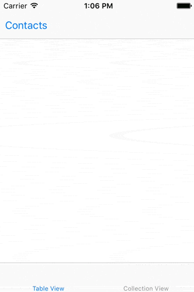

## TLDR

SGListAnimator provides animated transitions for your table and collection views, so you don't have to resort to calling `reloadData`, which blinks your UI over to the new state with no animation.

## The Problem

We all use table and collection views to display lists of things in our iOS apps. They're great components, and they come with a set of methods to animate changes as well. The catch is, you need to know what the changes are in order to know what animation methods to call.

If changes are being driven by your app, it's easy to know what they are. Often, though, we are displaying lists that come from somewhere else, like a server. When we get an updated list, we know that it probably changed just a little at most -- a new row here, a deletion or move there. Unfortunately, it's not so easy to compare the new and old lists to find all the differences. If your algorithm misses anything, your app crashes.

If your table view is backed by a Core Data table, you can use `NSFetchedResultsController`, which provides delegate callbacks that can be mapped to the animation methods. Everyone else mostly just gives up and calls `reloadData`.

## SGListAnimator

SGListAnimator compares your old and new lists, detects the different kinds of changes (there are 7), and calls the appropriate animation methods on your table or collection inside one or more animation blocks.

## Requirements

To use it, you need to:
- Represent your sections with objects that have unique identities -- header title strings work great.
- Represent your rows/items with objects that also have unique identities. This means they return appropriate values from `hash` and `isEqual`. Often you'll already be working with model objects that fit the bill.
- Never have duplicate sections or items.
- Keep the backing data for your table/collection view in an array property, so that when you have updated data, you've got old and new arrays handy.

## Installation

You can integrate via Cocoapods, use Git submodules, or just copy the relevant files into your project from this repo. Those files are the ones found in the `SGListAnimator` folder.

```ruby
 target 'MyTarget' do
    pod 'SGListAnimator'
 end
```

## Example Code

We've got a convenience class method to get you started. You just need to keep an array of your section titles, and another array of arrays that holds the items for each section:

```objective-c
- (void)updateTableView {
  // Save a reference to the previous content
  NSArray *oldSectionItems = self.sectionItems;
  NSArray *oldSectionTitles = self.sectionTitles;

  // Update your backing arrays to the new content
  self.sectionItems = ...
  self.sectionTitles = ...

  // And do the transition
  [SGListAnimator transitionTableView:self.tableView
      fromSectionItems:oldSectionItems
      titles:oldSectionTitles
      toSectionItems:self.sectionItems
      titles:self.sectionTitles
  ];
}

// Obviously, your table view data source methods will all use
// `self.sectionItems` and `self.sectionTitles`.

```

If you aren't dividing your list into sections, then you still have one section under the hood that you display with no header. Your code might look like this:

```objective-c
- (void)updateTableView {
  // Save a reference to the previous content
  NSArray *oldItems = self.tableViewItems;

  // Update your backing array to the new content
  self.tableViewItems = ...

  // And do the transition
  [SGListAnimator transitionTableView:self.tableView
      fromSectionItems:oldItems
      titles:@[@""]
      toSectionItems:self.tableViewItems
      titles:@[@""]
  ];
}

// Use self.tableViewItems in the data source methods.

```

To enable some of SGListAnimator's features like support for moves, you need to work with a SGListAnimator object, keeping your backing data in the animator's `currentSections` property. This allows the animator to separate transitions into multiple sub-transitions when necessary under the hood. You'll make a simple `SGListSection` object for each of your section; it holds the title and items array together in one handy object.

Here's a more complete example, with all 3 types of moves turned on:

```objective-c
#import "SGListAnimator.h"
#import "SGListSection.h"

...

@property (nonatomic) SGListAnimator *animator;

- (void)viewDidLoad {
  [super viewDidLoad];

  ...

  self.animator = [SGListAnimator new];
  self.animator.tableView = self.tableView;
  self.animator.doSectionMoves = YES;
  self.animator.doIntraSectionMoves = YES;
  self.animator.doInterSectionMoves = YES;
}

- (void)updateTableView {
    // Figure out what your new content is, creating each SGListSection
    // object with code like this:
    ...
    SGListSection *section = [SGListSection sectionWithTitle:... items:...];
    [newSections addObject:section];
    ...

    [self.animator transitionTableViewToSections:newSections];
}

// Use self.animator.currentSections in the data source methods, like:

- (NSInteger)tableView:(UITableView *)tableView numberOfRowsInSection:(NSInteger)section {
  return self.animator.currentSections[section].items.count;
}

...
```

## Features

- Handles section deletes, inserts, and moves. Handles row/item deletes, inserts, moves within a section, and moves from one section to another.
- Supports `UITableView` and `UICollectionView` both.
- Lets you opt-in to support for the three types of moves. Moves require more involved computations that may be more expensive, depending on the size of your lists and how much they are changing.  Many applications don't require all the types of moves.
- Thoroughly unit tested, and stress tested. The included demo app provides a stress test using random data, which did uncover a bug during development.
- Swift & Objective-C both supported. We haven't done much with Swift here, so let us know if any improvements are needed. The table view in the demo app is written in Swift, while the collection view is in Objective-C.
- Tested on iOS 8 & 9. Should work fine on iOS 7 I think.
- No dependencies.

## To do

- The animator has not been heavily tested / profiled with large lists (i.e. thousands of items). It's good to use approaches like pagination to avoid spewing large numbers of objects into your client, so hopefully most folks will be dealing with at most one or two hundred items at a time.
- It would be nice to provide a hook for client code to fine tune the animations that are used. Currently some decent choices are hard coded for table views, and collection views use default behavior.
